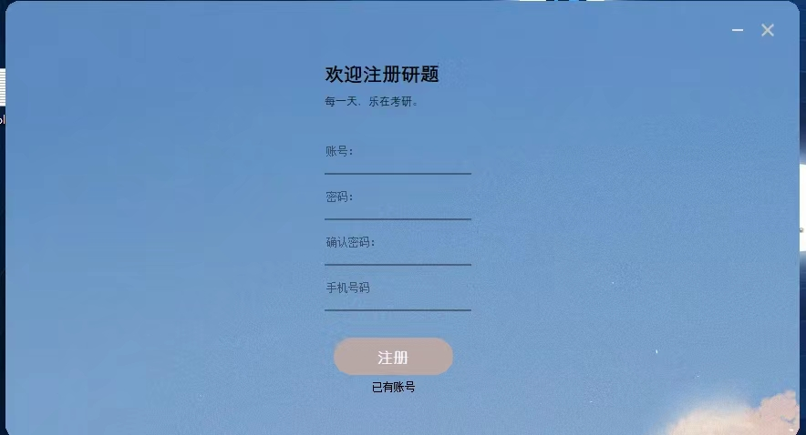
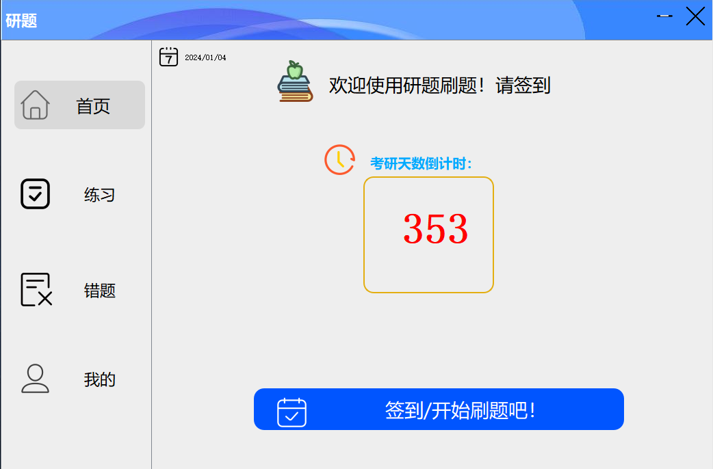
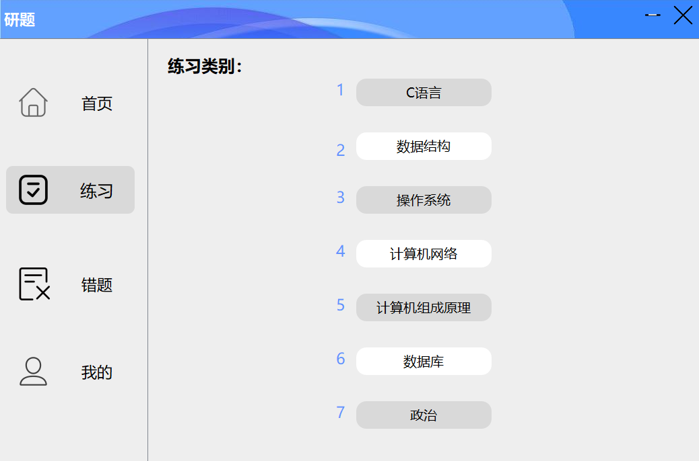
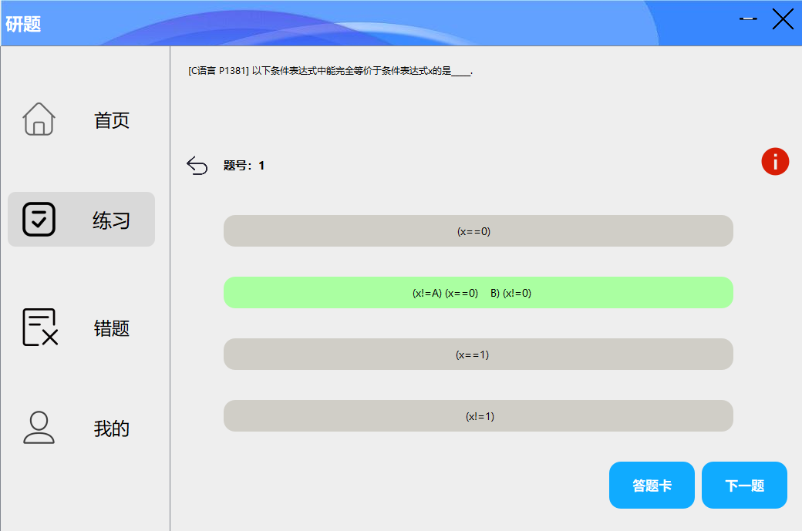
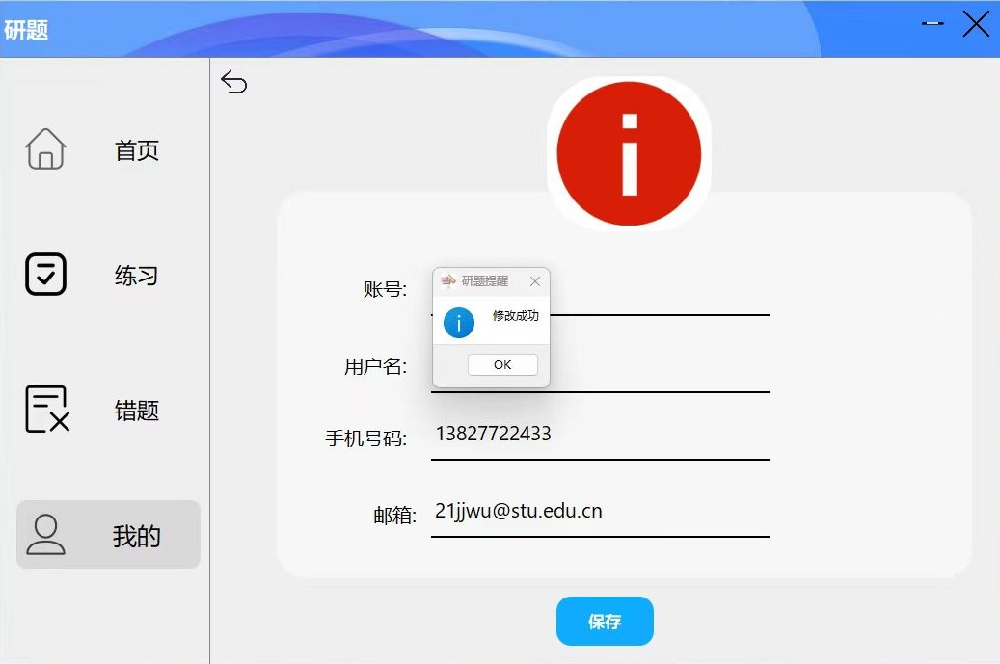

# 考研刷题系统 📚💻

## 项目背景 🌟

考研刷题系统是为考研学生设计的交互式平台，目的在于帮助用户进行题目练习、知识巩固和模拟考试，以更好地准备考研。🎓✨

## 项目整体功能 🚀

考研刷题系统提供了一个基于PyQt5的交互式平台，涵盖了登录、题目练习和资源管理等功能。通过多个模块和资源文件的整合，为考研学生提供了一套便捷、可视化的刷题系统。🔍📝

## 功能概述 📋

### 用户登录与管理 🔐

#### LoginUI\LoginUI.py

该文件包含了登录界面的布局和交互逻辑。用户通过该界面输入用户名和密码以登录系统。

#### LoginUI\main3.py

主程序入口，负责创建并显示登录界面。用户可以在此界面登录系统。

#### 主代码更新\logindemo.py

提供了一个登录界面的演示程序，用于展示登录界面的功能和外观。

### 题目练习与测试 📝

#### unit_demo2\unit_demo2.py

该文件管理了一个基于PyQt5的交互式应用程序。它包含了答题、完成练习等功能，用户可以通过该界面进行考试练习。

#### unit_demo2\unit_demo_launch2.py

用于启动和管理unit_demo2的PyQt5应用程序，用户通过该程序进入考试练习界面。

#### unit_demo3\launch.py

启动unit_demo3的PyQt5 GUI应用程序，可练习特定类型的题目。

### 资源管理及界面交互 🎨

#### LoginUI\resource_rc.py

包含界面所需的图像、图标等资源，用于美化用户界面和增强用户体验。

#### shiftpage.py

定义了一个用于处理用户界面(UI)中页面切换的类。用户可以通过该功能在不同界面之间切换。

### 使用方法 🛠️
启动文件为 `main0.0.12`。
- **注册：** 
  用户在第一次运行时，需要注册账号。
- 
- **登录：** 
  1. 输入用户名和密码在登录界面中。

  2. 点击登录按钮进入系统。

- **不同题型分类选择：** 
  1. 进入系统后，选择不同类型的题目练习。

- **刷题界面：** 

- **个人主页相关信息修改：** 

_注：以上是基于已有文件和功能描述的概要，具体细节请查看代码文件本身。_
